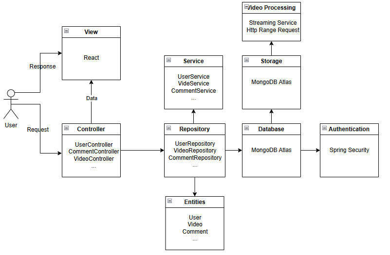
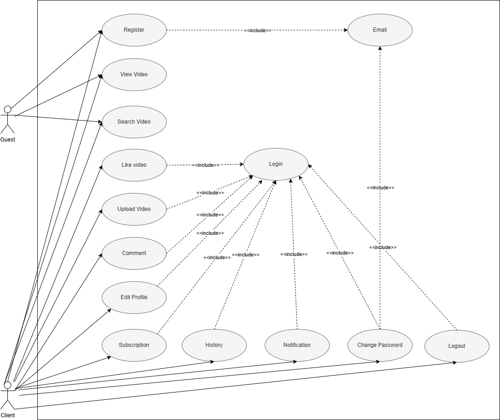
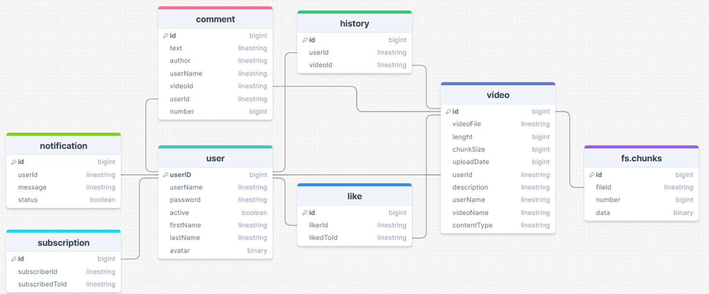
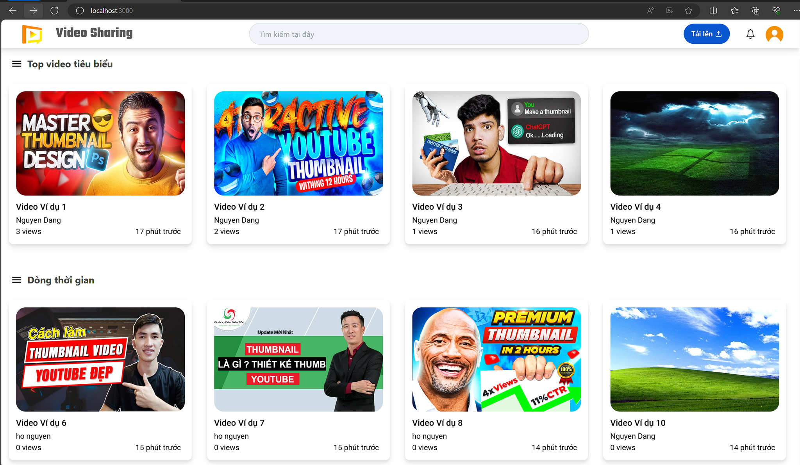
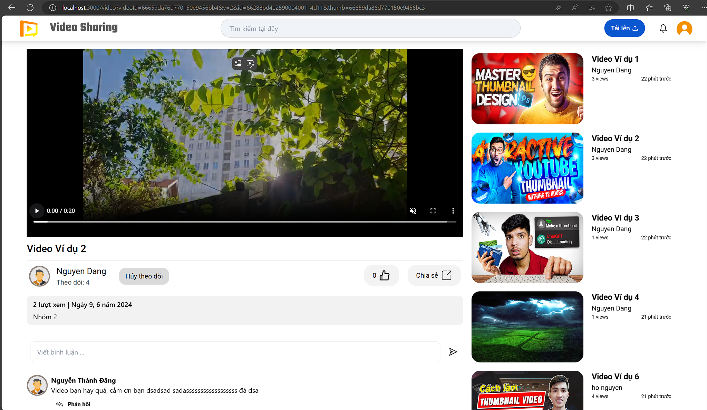
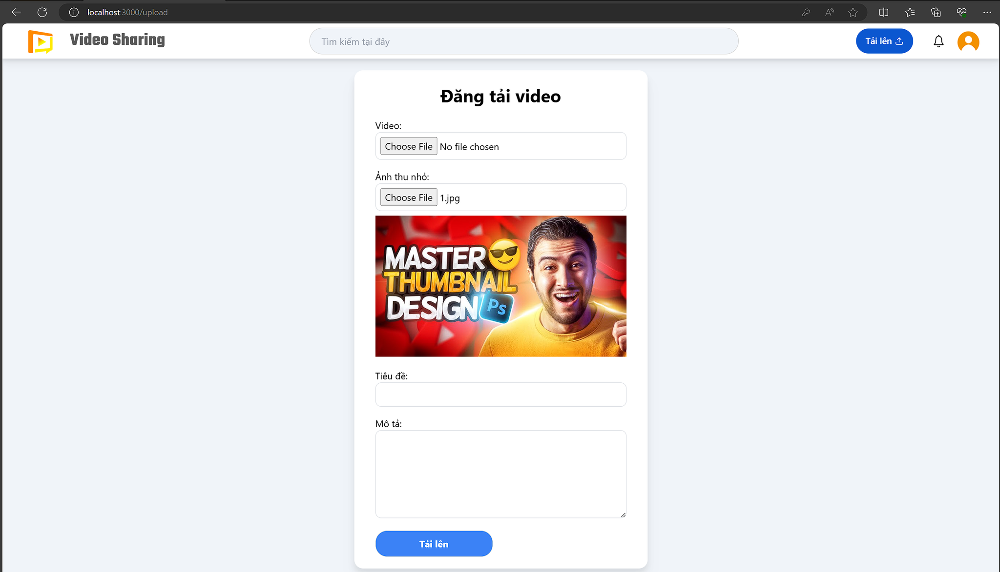

# Video Sharing Application

<div align="center">
    
</div>

## Overview

This is a Video Sharing Application built using Spring Boot, React, and MongoDB. The application allows users to register, login, upload videos (including thumbnails and details), view videos, comment on videos, and like videos. 

## Features

- User Registration and Login
- Video Upload (Video file, thumbnail, and details)
- Video Viewing
- Commenting on Videos
- Liking Videos
- Video Streaming with HTTP Range Request
- History and Notification

## Architecture

The application follows the Model-View-Controller (MVC) architectural pattern.



### Components

- **Frontend**: React
- **Backend**: Spring Boot
- **Database**: MongoDB
- **Authentication & Authorization**: Spring Security
- **Video Processing and Streaming**:
  - Video Transcoding (FFmpeg)
  - Streaming Service (HTTP Range Request)
- **APIs**:
  - REST APIs

### Use Case


### Database



## Prerequisites

- Java 11 or higher
- Node.js
- MySQL or PostgreSQL
- FFmpeg

## Installation

1. **Clone the repository:**
   ```bash
   git clone https://github.com/Video-Sharing-Project-UIT/Video-Sharing-Backend.git
   ```
2. **Backup setup:**
    - Navigate to the backend directory:
    ```bash
    cd Video-Sharing-Backend
    ```
    - Configure the database in src/main/resources/application.properties:
    ```bash
    spring.datasource.url=jdbc:mysql://localhost:3306/video_sharing_db
    spring.datasource.username=root
    spring.datasource.password=yourpassword
    ```

    - Build the backend application:
    ```bash
    ./mvnw clean install
    ```

    - Run the backend application:
    ```bash
    ./mvnw spring-boot:run
    ```

3. **Frontend Setup:**
    - Clone Repository
    ```bash
    git clone https://github.com/Video-Sharing-Project-UIT/Video-Sharing-Frontend.git
    ```
    - Navigate to the frontend directory:
    ```bash
    cd Video-Sharing-Frontend
    ```
    - Install dependencies:
    ```bash
    npm install
    ```

    - Start the frontend application:
    ```bash
    npm start
    ```

## Usage
1. **Home Page:**
    - Main page choose video



4. **View video:**
    - Browse and view videos uploaded by users.



3. **Upload video:**
    - Navigate to the upload section and upload your video along with the thumbnail and details.



6. **History:**


7. **Notification:**


## Contributors
- [Trinh Tan Dat](https://github.com/Trinh-Tan-Dat)
- [Nguyen Thanh Dang](https://github.com/thelight3007)
- [Nguyen Tran Bao Quoc](https://github.com/TonyQ2k3)
- [Ta Duc Bao](https://github.com/DucBaoUIT)


## License
This project is licensed under the MIT License - see the [LICENSE](LICENSE) file for details.
## Contact

## Demo


## Report

For detailed information about the project, please refer to the [project report](images/Report.pdf).


